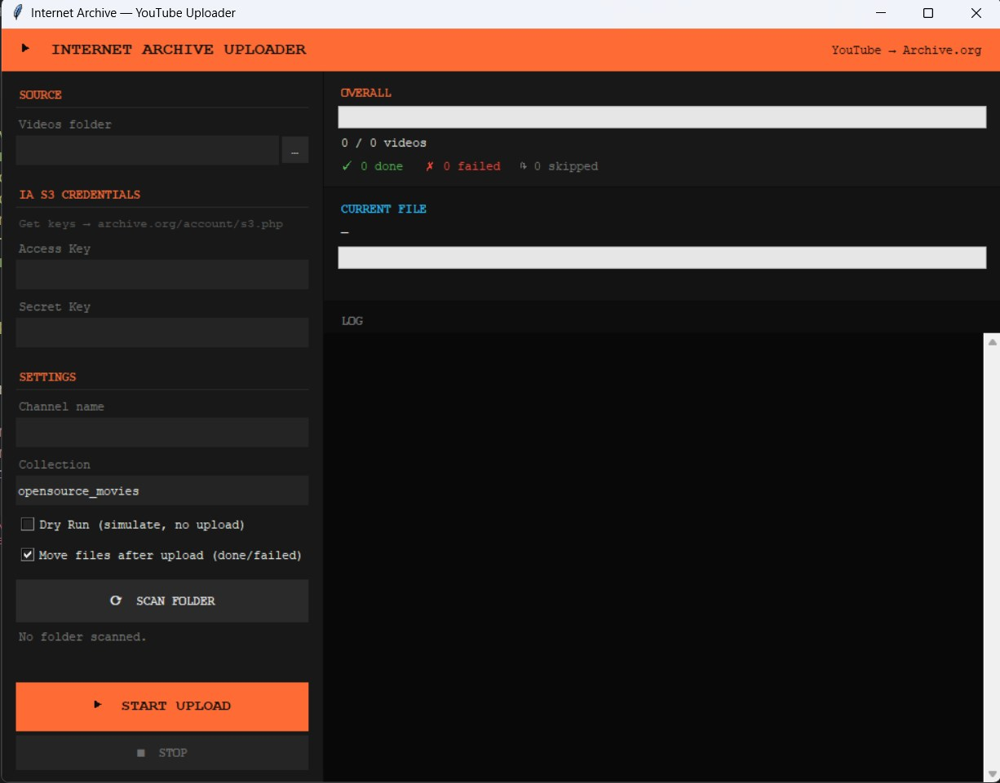

# Internet Archive Uploader



A desktop GUI tool for batch-uploading files to [Archive.org](https://archive.org).

Built for anyone who wants to preserve files on the Internet Archive — videos, audio, images, documents, or any file type — with resume support, real-time progress, and automatic metadata extraction.

---

## Features

- **Batch upload** — scans a folder for files and uploads each as a separate IA item
- **Any file type** — video, audio, images, PDFs, documents, or any format via Generic mode
- **Resume support** — tracks uploaded files in a local state file; restart anytime without re-uploading
- **Real-time progress** — per-file progress bar with speed (MB/s) and ETA
- **Session summary** — total time, MB transferred, and average speed shown at end of session
- **Metadata from yt-dlp** — reads `.info.json` and `.description` sidecar files for title, date, uploader, tags
- **Date parsing** — extracts `YYYYMMDD` from filenames (e.g. `VideoTitle20151024.mp4`) as fallback
- **Auto file organization** — moves uploaded files to `done/` and failed ones to `failed/`
- **Retry logic** — up to 5 attempts per file with 12-second delay between retries
- **Retry failed only** — re-queue only failed items without resetting successful uploads
- **Dry run mode** — simulate the full upload process without sending anything
- **Saved credentials** — access key, secret, and settings persist between sessions in a local config file
- **Credential test** — verify your IA keys before starting a batch
- **Clickable links** — each successful upload shows a live Archive.org link you can open directly
- **Auto log** — every session is written to `ia_upload.log`; export a copy anytime with Save Log
- **Unicode-safe** — handles Arabic, CJK, emoji, and other non-latin-1 characters in metadata headers

---

## Requirements

- Python 3.8+
- `requests` library

```bash
pip install -r requirements.txt
```

Tkinter is included in standard Python on Windows and most Linux distros. On Ubuntu/Debian:

```bash
sudo apt install python3-tk
```

---

## Setup

### 1. Get Internet Archive S3 credentials

Go to [archive.org/account/s3.php](https://archive.org/account/s3.php) and copy your **Access Key** and **Secret Key**.

> A free Archive.org account is sufficient for most uploads.

### 2. Prepare your files

**Video mode (default)** — expects `.mp4` files, optionally with yt-dlp sidecar files:

```
/my-channel/
    VideoTitle [abcXYZ123].mp4
    VideoTitle [abcXYZ123].info.json      ← optional but recommended
    VideoTitle [abcXYZ123].description    ← optional
    AnotherVideo20200314 [defABC456].mp4
    ...
```

Downloaded with a command like:
```bash
yt-dlp --write-info-json --write-description -o "%(title)s [%(id)s].%(ext)s" https://www.youtube.com/@channel
```

**Generic mode** — any file type, any structure. Just point to a folder and every file gets uploaded as its own IA item. Mediatype is inferred automatically from the file extension.

---

## Usage

```bash
python Internet_Archive_Uploader.py
```

1. **Select folder** — point to the directory containing your files
2. **Enter credentials** — paste your IA Access Key and Secret Key, then click **Save** to persist them
3. **Test credentials** — click **Test** to verify your keys before starting
4. **Set creator** — used to build the IA identifier and set the `creator` metadata field
5. **Set collection** — defaults to `opensource_movies` (video mode) or `opensource` (generic mode)
6. **Scan folder** — previews how many files were found and total size
7. **Start Upload** — begins uploading; stop and resume at any time

### Options

| Option | Description |
|--------|-------------|
| **Dry Run** | Simulates the upload loop without sending any files |
| **Generic mode** | Upload any file type, not just `.mp4` |
| **Move files after upload** | Moves completed files to `done/` and failed ones to `failed/` |
| **Retry failed only** | Re-queues only failed items; successful uploads are untouched |
| **Save Log** | Exports the current session log to a file of your choice |
| **Reset all** | Clears entire upload history so all files are re-uploaded from scratch |

---

## Persistent files

| File | Purpose |
|------|---------|
| `ia_upload_state.json` | Tracks uploaded / failed / skipped item IDs |
| `ia_config.json` | Saved credentials and settings |
| `ia_upload.log` | Rolling log of all sessions |

Do not delete `ia_upload_state.json` if you want to resume a session.

---

## IA item structure

Each file becomes a separate Archive.org item. In video mode, all associated sidecar files (`.info.json`, `.description`) are uploaded to the same item.

The IA identifier is built as: `{creator}-{file_id}`, sanitized to alphanumerics and hyphens, max 80 characters.

Mediatype is assigned automatically based on file extension:

| Extension | Mediatype |
|-----------|-----------|
| `.mp4`, `.mkv`, `.avi`, `.mov`, `.webm` | `movies` |
| `.mp3`, `.wav`, `.flac`, `.ogg`, `.m4a`, `.aac` | `audio` |
| `.jpg`, `.jpeg`, `.png`, `.gif`, `.webp` | `image` |
| `.pdf`, `.djvu` | `texts` |
| everything else | `data` |

---

## License

MIT
